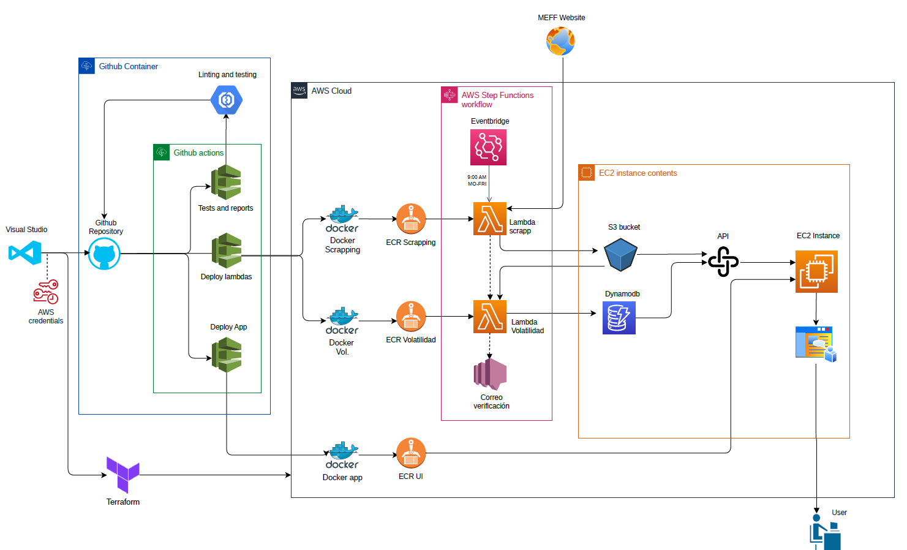
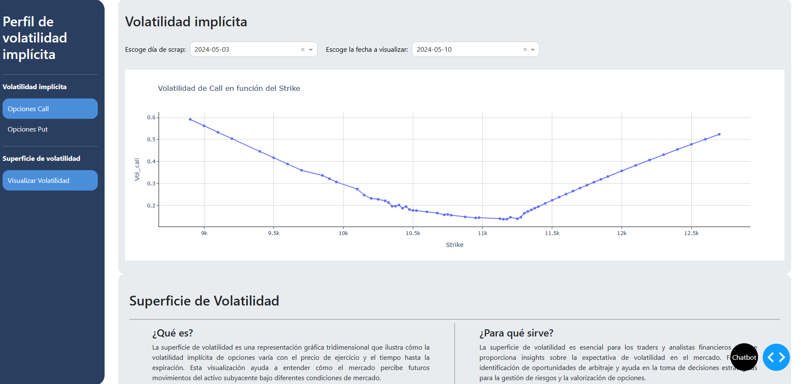
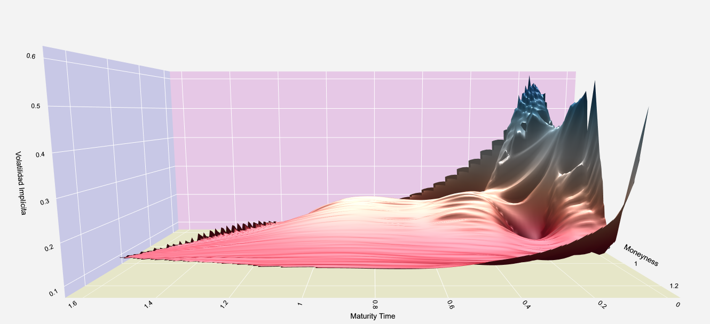
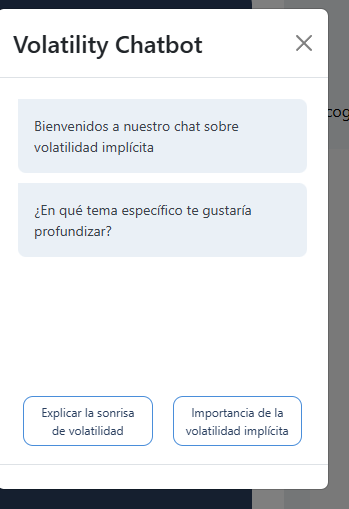

# Aplicación de Análisis de Volatilidad Implícita

## Accesos directos

 - **Interfaz web:** http://13.37.203.83:8050/
 - **Repositorio github:** https://github.com/aperezcoscu/Practica-3.git

## Descripción
Este proyecto es una aplicación web que tiene el objetivo de proporcionar análisis sobre la volatilidad implícita de las opciones del MINI IBEX. Para lograrlo, he integrado una serie de servicios de Amazon Web Services (AWS), entre ellos Lambda, ECR, DynamoDB, S3, EC2, EventBridge y el Simple Notification Service (SNS). Cada uno de estos servicios juega un papel importante en el procesamiento y almacenamiento de los datos, así como en la ejecución y manejo de la aplicación.

La interfaz de usuario de la aplicación está diseñada para ser intuitiva y fácil de usar. Permite a los usuarios explorar detalladamente los datos de volatilidad implícita para las opciones call y put, y visualizar cómo estas métricas varían con el tiempo y con diferentes precios de ejercicio. Una característica distintiva del proyecto es su capacidad para mostrar la superficie de volatilidad, una herramienta visual que representa tridimensionalmente la volatilidad implícita en función del tiempo hasta el vencimiento y del precio de ejercicio de las opciones.

## Características

- **Plataforma de Hospedaje**: AWS.
- **Automatización con GitHub Actions**:
  - **PR Workflow (`pull_request.yml`)**: Ejecuta flake8 y tests unitarios en cada pull request.
  - **Main Merge Workflow (`merge_main.yml`)**: Despliega la aplicación en AWS en cada merge a la rama main.
  - **Lambda Deployment Workflow (`lambda_deploy.yml`)**: Gestiona el despliegue de funciones Lambda.
- **Funciones AWS Lambda**:
  - **Función de Web Scraping**: Se ejecuta según un cron de AWS EventBridge a las 10:00 AM de lunes a viernes, guarda los datos en el S3 bucket.
  - **Función de Cálculo de Volatilidad**: Procesa los datos del S3 bucket, calcula la volatilidad y los almacena en DynamoDB.
- **AWS EventBridge**: Programa las funciones Lambda con un cron específico.
- **SNS**: Al finalizar la ejecución de las funciones lambda, se envía un correo notificando de esto.
- **Almacenamiento AWS**:
  - **S3 Bucket (`scrap-miax-12`)**: Almacena los datos extraídos por la función de web scraping.
  - **DynamoDB**: Almacena los resultados de la volatilidad calculados por la función de cálculo de volatilidad.
- **API**:
  - **Local API**: Se ha craedo una api local en la instancia para poder conectarnos a la base de datos y obtener las volatilidades de las diferentes opciones.
- **Interfaz de Usuario (UI)**:
  - **Dash**: Aplicación web que permite visualizar y comparar skews de volatilidad, y muestra la superficie de volatilidad y su evolución.

## Arquitectura del proyecto

El código de este proyecto se ha desarrollado utilizando Visual Studio y todo el código está alojado en un repositorio de GitHub, el cual está configurado con acciones automatizadas descritas en archivos YAML para gestionar las pruebas, el despliegue y la operación de la aplicación. A continuación se puede observar en la imagen la arquitectura del servicio creado:

### Integración y despliegue

**Pruebas y Reportes Automatizados**
La primera acción de GitHub es crucial trata de mantener la calidad del código. Esta acción ejecuta análisis de estilo con flake8 y pruebas unitarias con pytest para verificar que todas las funciones cumplen con los estándares de calidad y funcionan como se espera.

**Despliegue de Funciones Lambda**
La segunda acción se encarga del despliegue automatizado de las dos funciones Lambda del proyecto. El procedimiento del despliegue de las funciones es el mismo, primero se crea una imagen en Docker, a continuación, se crea en ECR un repositorio para poder alojar la imagen de Docker, y finalmente se crean las funciones lambda.
Para activar estas funciones se ha utilizado Eventbridge, el cual se ejecuta cada mañana de lunes a viernes a las 10:00AM. Las funciones son las siguientes:

 - **Web Scraping de Datos**: Esta función realiza web scraping en la página de MEFF para obtener datos de opciones y futuros del MINI IBEX y los almacena en un bucket de S3.
 - **Cálculo de Volatilidad Implícita**: La segunda función Lambda accede a estos datos almacenados en S3, calcula la volatilidad implícita para cada opción utilizando modelos financieros avanzados, y guarda los resultados en una base de datos DynamoDB. Un aviso por correo electrónico es enviado automáticamente una vez que estas tareas se completan.

Una vez ejecutadas las lambdas, mediande SNS, se envía un correo a una dirección específica corroborando la ejecución de las dos lambdas.

 - **Despliegue de la Aplicación**
 La tercera acción de GitHub gestiona el despliegue de la interfaz de usuario. Compila la aplicación, crea una imagen Docker, y la sube a Amazon ECR. Desde allí, la aplicación se despliega en una instancia EC2.

### API Local y Frontend
**API local**
Una API desarrollada localmente en la instancia EC2 permite acceder de forma segura a los datos de S3 y DynamoDB. Esta API es el puente entre los datos almacenados y la interfaz de usuario, asegurando que los usuarios tengan acceso a la información actualizada y relevante.
A continuación se muestra una imagen de la interfaz:

## Características de la Interfaz de Usuario

La interfaz de usuario de esta aplicación web está diseñada para ofrecer una experiencia intuitiva y educativa, permitiendo a los usuarios interactuar y profundizar en el análisis de la volatilidad de las opciones. Aquí están las características principales:

### Menú de Opciones

- **Selección de Volatilidad de Opciones Call y Put**: Desde un menú lateral, los usuarios pueden seleccionar si desean visualizar la volatilidad implícita de las opciones Call o Put, proporcionando un acceso rápido a la información más relevante según sus necesidades.

### Filtros Interactivos

- **Desplegables para Fechas y Vencimientos**: La aplicación incluye desplegables que permiten a los usuarios seleccionar la fecha del dato obtenido mediante scraping y los vencimientos de las opciones. Esto permite una personalización detallada de los gráficos y análisis mostrados, adaptando la información al contexto específico que el usuario desea explorar.

### Visualización de la Superficie de Volatilidad

- **Gráficos Interactivos y Explicaciones**: Una sección dedicada a la visualización de la superficie de volatilidad muestra gráficos tridimensionales interactivos que ilustran cómo la volatilidad implícita varía con el precio de ejercicio y el tiempo hasta el vencimiento. Esta herramienta visual es fundamental para entender las expectativas del mercado y la percepción del riesgo.

A continuación se muestra un ejemplo de la superficie de volatilidad que se puede visualizar en la aplicación:

Este gráfico tridimensional interativo permite a los usuarios entender cómo la volatilidad implícita varía con el precio de ejercicio y el tiempo hasta el vencimiento. La interfaz proporciona herramientas para manipular la vista del gráfico, ofreciendo una comprensión más profunda de las dinámicas del mercado.

- **Información Educativa**: Acompañando a los gráficos, se ofrecen explicaciones detalladas que ayudan a los usuarios a comprender qué representa la superficie de volatilidad y cómo interpretarla, lo que convierte a la aplicación en un recurso educativo valioso.

### Asistencia Interactiva

- **Chatbot**: Para soporte adicional y educación sobre volatilidad implícita, la interfaz incluye un chatbot que puede responder preguntas frecuentes y proporcionar explicaciones sobre términos y conceptos relacionados con la volatilidad. Esta funcionalidad busca hacer la experiencia de usuario más accesible y enriquecedora, especialmente para aquellos nuevos en el análisis de mercados financieros.
A continuación se muestra una imagen del chatbot.

## Despliegue automatizado con Terraform

Este proyecto utiliza Terraform para automatizar la creación y gestión de la infraestructura necesaria en AWS, asegurando un despliegue consistente y reproducible del entorno. El archivo de Terraform define y configura todos los recursos necesarios, como funciones Lambda, buckets de S3, tablas de DynamoDB, repositorios ECR, y la instancia EC2 que hospeda la aplicación web.

### Archivos de Terraform

Los archivos de Terraform están estructurados para proporcionar una creación clara y mantenible de la infraestructura en la nube:

- **Archivos .tf**: Contienen la definición de todos los recursos de AWS utilizados en el proyecto, incluyendo configuraciones de seguridad, políticas de IAM y detalles de red.
- **Despliegue**: Para desplegar o actualizar la infraestructura, simplemente ejecuta los comandos terraform init, seguido de terraform plan y terraform apply dentro del directorio que contiene los archivos de Terraform.

El uso de Terraform facilita la gestión de la infraestructura como código, permitiendo actualizaciones y cambios de configuración de manera controlada y documentada, lo que reduce el riesgo de errores humanos y aumenta la eficiencia del despliegue.

## Prerrequisitos

### Acceso a la Interfaz Web

Para acceder a la interfaz de la aplicación y explorar las funcionalidades en vivo, visita la siguiente URL:

http://13.37.203.83:8050/

### Repositorio de Código Fuente

El código fuente de la aplicación está disponible públicamente en GitHub. Puedes acceder al repositorio para revisar el código, realizar forks o contribuir al proyecto a través del siguiente enlace:

https://github.com/aperezcoscu/Practica-3.git

### Requisitos de Software

Para trabajar localmente con el código o contribuir al desarrollo, necesitarás tener instalados los siguientes programas y librerías:

- **Python**: La aplicación está escrita en Python, asegúrate de tener Python 3.8 o superior instalado.
- **Librerías de Python**: Instalación de las librerías especificadas en el archivo `requirements_app.txt` del repositorio. Puedes instalarlas utilizando el comando:
- **Docker:** Para ejecutar los contenedores localmente o construir nuevos, necesitarás Docker instalado y configurado en tu máquina.
- **Acceso a AWS:** Para el despliegue de la aplicación o pruebas con servicios AWS, necesitarás credenciales de AWS configuradas en tu entorno local.

**Configuración de AWS**
Es necesario configurar las credenciales de AWS para interactuar con los servicios utilizados (Lambda, DynamoDB, S3, EC2). Asegúrate de configurar tu CLI de AWS con un perfil que tenga los permisos necesarios.

## Contacto

Para soporte, envía un correo a aperezcoscu@gmail.com.